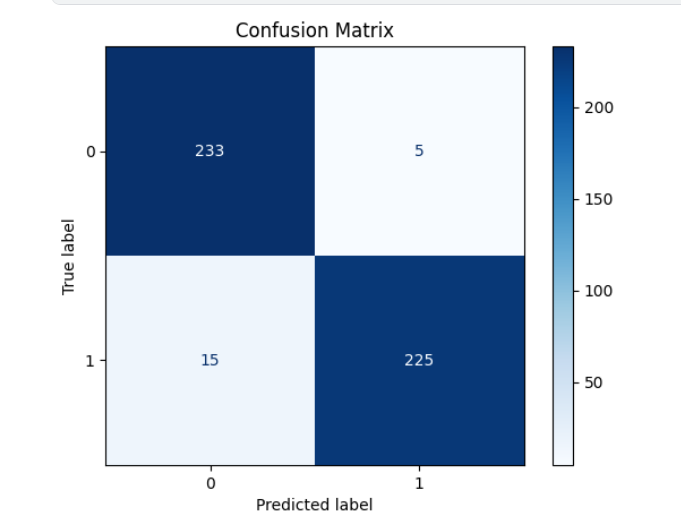

# Pneumonia Classification Using Different CNNs

---

## Introduction
Pneumonia is a serious respiratory infection that primarily affects the lungs, causing complications if not diagnosed and treated promptly. However, diagnosing pneumonia accurately can be challenging due to human error and the limited availability of radiologists in remote areas. 

This project leverages advances in machine learning (ML) and deep learning to:

- Automatically analyze chest radiographs.
- Improve diagnostic accuracy.
- Support radiologists by acting as a second opinion.

---

## Dataset
The dataset consists of 5,863 chest X-ray images categorized into:

- **Pneumonia**
- **Normal**

The images are organized into three folders: `train`, `test`, and `validation`. The dataset includes:

1. Normal chest X-rays (clear lungs).
2. Bacterial pneumonia (focal lobar consolidation).
3. Viral pneumonia (diffuse "interstitial" patterns).

---

## CNN Architectures
Three different Convolutional Neural Network (CNN) architectures were used in this project:

### 1. ResNet-50
- **Highlights**:
  - Uses residual learning to ease training of deep networks.
  - Mitigates vanishing gradient problems.
  - Optimizer: ADAM, Learning Rate: 0.001, Weight Decay: 0.0001.

   
   

### 2. DenseNet-121
- **Highlights**:
  - Builds on ResNet by introducing dense connections (feature reuse).
  - Reduces parameter usage and enables better feature propagation.
  - Optimizer: SGD, Learning Rate: 0.0001, Momentum: 0.9.

   
   

### 3. Xception
- **Highlights**:
  - Based on the inception hypothesis (decoupling spatial and channel relationships).
  - Uses depthwise separable convolutions to reduce computational cost.

   
   

---

## Data Preprocessing
- **ResNet-50**:
  - Resize to 224x224.
  - Convert grayscale to RGB.
  - Random horizontal flip.
  - Normalize (mean: [0.485, 0.456, 0.406], std: [0.229, 0.224, 0.225]).

- **DenseNet-121**:
  - Convert grayscale to RGB.
  - Resize to 256x256, crop to 224x224.
  - Normalize (mean: [0.485, 0.456, 0.406], std: [0.229, 0.224, 0.225]).

- **Xception**:
  - Rescale pixel values to [0, 1].
  - Resize to 299x299x3.

---

## Results
### Accuracy, Loss, and ROC AUC
- **Accuracy**:
  - ResNet: Best accuracy progression and convergence.
  - DenseNet: Stabilizes quickly but slightly underperforms compared to ResNet.
  - Xception: Instability limits generalization.

- **Loss**:
  - ResNet: Lowest and most stable loss.
  - DenseNet: Efficient but stagnates early.
  - Xception: Struggles with loss optimization.

- **ROC AUC Curve**:
  - ResNet achieves balanced and accurate predictions.

### Classification Metrics
| Model      | Class      | Precision | Recall | F1-Score |
|------------|------------|-----------|--------|----------|
| **ResNet** | NORMAL     | 0.94      | 0.98   | 0.96     |
|            | PNEUMONIA  | 0.98      | 0.94   | 0.96     |
| **Xception** | NORMAL     | 0.94      | 0.99   | 0.97     |
|            | PNEUMONIA  | 0.99      | 0.94   | 0.96     |
| **DenseNet** | NORMAL     | 0.96      | 0.93   | 0.95     |
|            | PNEUMONIA  | 0.93      | 0.96   | 0.95     |

---

## Visualization
### Accuracy Plots
- ResNet, Xception, and DenseNet Accuracy Progression:

  

### Loss Plots
- ResNet, Xception, and DenseNet Loss Progression:

  

### Confusion Matrices
- Model Confusion Matrices:

  

### ROC Curves
- ROC AUC for ResNet, Xception, and DenseNet:

  

---

## Analysis
- ResNet produces the most balanced and accurate results.
- DenseNet efficiently minimizes loss but misclassifies more NORMAL samples.
- Xception struggles with instability and misclassification of PNEUMONIA cases.

---

## Conclusion
ResNet-50 outperforms DenseNet-121 and Xception in this project. Its robust architecture, balanced complexity, and effective training on limited data make it the best choice for pneumonia classification. Fine-tuned models like Xception and DenseNet struggled to adapt to the small dataset's nuances.

---

## References
1. François Chollet. Xception: Deep learning with depthwise separable convolutions, 2017.
2. Kaiming He et al. Deep residual learning for image recognition, 2015.
3. Gao Huang et al. Densely connected convolutional networks, 2018.
4. Olga Russakovsky et al. Imagenet large scale visual recognition challenge, 2015.
5. Christian Szegedy et al. Rethinking the inception architecture for computer vision, 2015.
